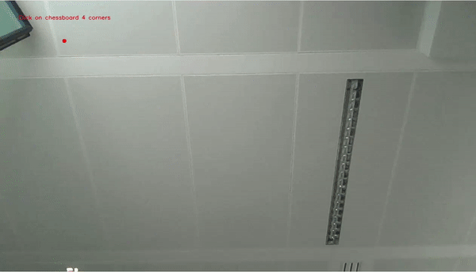

# Aruco Chess
Calibration and Aruco Marker Recognition for chess boards using aruco Markers for each piece.

## Demo 

### Camera calibration
To run the code, first calibrate your camera by printing out the opencv chessboard pattern at ``` ./Print/pattern.png ``` And taking various pictures, around 10, at different angles like this: 

.

Place the pictures at ```./samples/Chessboard_Images ```
Then run ```./camera_calibration.py``` :
```python 
python3 camera_calibration.py --dir ./Chessboard --square_size 0.024 --width 9 --height 6 
```

### Board calibration 

To calibrate the board, point the camera over or under your chessboard, and run:  ```./board_calibration.py``` :
```python 
python3 board_calibration.py
```
Click on the 4 corners of your board like this : 

.

### Playing Chess

Print out the aruco markers at ```Print/arucoMarkerschesspieces.pdf```. They correspond to the black and white pieces like this:

{2 : "R",3 : "N",4 : "B",5 : "Q",6 : "K", 7 : "p", 8 : "r",9 : "n",10 : "b",11 : "q",12 : "k" , 13 : "P"}

The integer being the aruco marker ID and the character being the white and black pieces (lowercase for black).


Then, run ```./pose_estimation_video.py``` :
```python 
python3 pose_estimation_video.py
```
Your game should look like this, with the current game state printed out as a FEN string in the console: 

.
